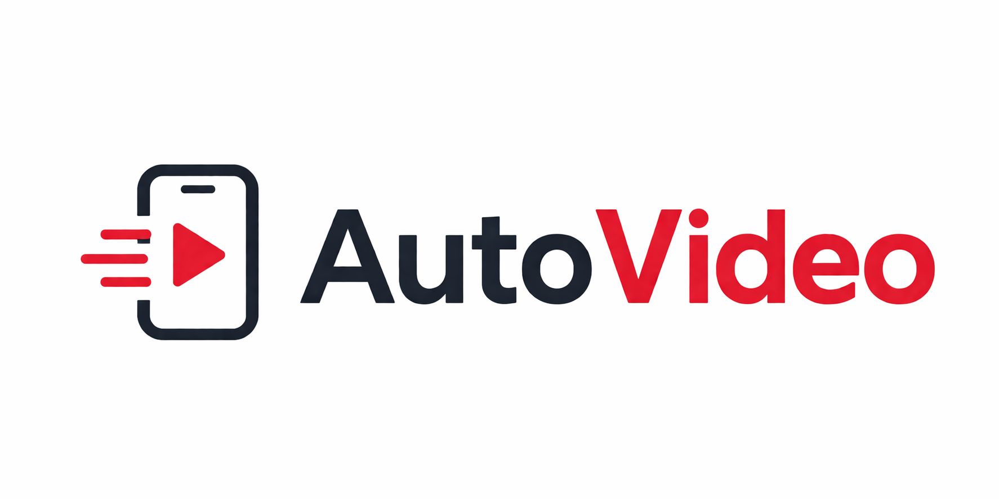

## AutoVideo – Auto-render vertical videos for YouTube

<p align="center">
  <picture>
    
  </picture>
</p>

AutoVideo turns plain text into 9:16 vertical videos through a fully automated pipeline:
- split input into micro‑scenes (`narration`, `onScreenText`, `imageQuery`)
- fetch stock media (photos/videos)
- generate TTS per scene
- render MP4 and (optionally) upload to YouTube

---

## Quick start

### 1) Install dependencies

```bash
pip install -r requirements.txt
```

### 2) Configure the app

- Edit `config.yaml` (no secrets inside).
- Create a `.env` file for all API keys and secrets.
- Default output directory is `output/`.

Commonly used `config.yaml` options:
- `pexels.media`: `photo` or `video`
- `tts.enabled`: enable/disable TTS
- `tts.provider`: `auto` / `edge` / `elevenlabs` / `google_chirp3`
- `audio.bgm_enabled`: enable/disable background music
- `audio.bgm_dir`: background music folder (default `asset/songs`)
- `audio.bgm_volume`: background music volume when mixed with narration
- `youtube.upload`: enable/disable automatic YouTube upload

### 3) Run the API server

```bash
uvicorn main:app --host 0.0.0.0 --port 8000 --reload
```

Interactive API docs: [http://127.0.0.1:8000/docs](http://127.0.0.1:8000/docs)

---

## Tech stack

**Default**
- Backend API: `FastAPI`, `Uvicorn`
- Data model/validation: `Pydantic`
- Config: `PyYAML`, `python-dotenv`
- HTTP client: `requests`
- Video rendering: `MoviePy`, `ffmpeg` / `ffprobe` (via `imageio-ffmpeg`)
- Text/captions: `Pillow`
- Default TTS: `edge-tts`
- Media providers: Pexels / Unsplash integration
- YouTube upload: `google-api-python-client`, `google-auth`, `google-auth-oauthlib`

**Optional (config/env‑controlled)**
- High‑quality TTS: `ElevenLabs` (`elevenlabs`)
- High‑quality TTS: `Google Cloud Chirp 3` (`google-cloud-texttospeech`)
- LLM backend for micro‑story generation: `Ollama` or `Gemini`

### Google Chirp 3 quick setup (optional)

1. Install dependencies:
   ```bash
   pip install -r requirements.txt
   ```
2. Set ADC credentials (service account JSON):
   ```bash
   export GOOGLE_APPLICATION_CREDENTIALS="/absolute/path/service-account.json"
   ```
3. Update `config.yaml`:
   - `tts.provider: google_chirp3` (or keep `auto`)
   - `tts.google_chirp3.enabled: true`
   - choose `voice_name` + `language_code` (for example `vi-VN-Chirp3-HD-Aoede`, `vi-VN`)
   - optional region: `global`, `us`, `eu`, `asia-southeast1`, `europe-west2`, `asia-northeast1`

---

## Main API endpoints

- `POST /api/v1/jobs/build-script-from-txt` – upload a `.txt` file and build a micro‑story
- `POST /api/v1/jobs/full-from-txt` – run the full pipeline (build → media → TTS → render)
- `POST /api/v1/jobs/{job_id}/fetch-media`
- `POST /api/v1/jobs/{job_id}/tts`
- `POST /api/v1/jobs/{job_id}/render`
- `POST /api/v1/jobs/{job_id}/upload-youtube`

---

## Notes

- If YouTube returns `invalid_grant`, delete the old token at `~/.cache/murphy_api/youtube/token.json` and try uploading again to refresh OAuth.
- Background music is automatically looped/concatenated from `audio.bgm_dir` if the playlist is shorter than the final video.

---

## Demo

Demo channel: https://www.youtube.com/@cheatforlife
<p align="center">
  <picture>
    
  </picture>
</p>